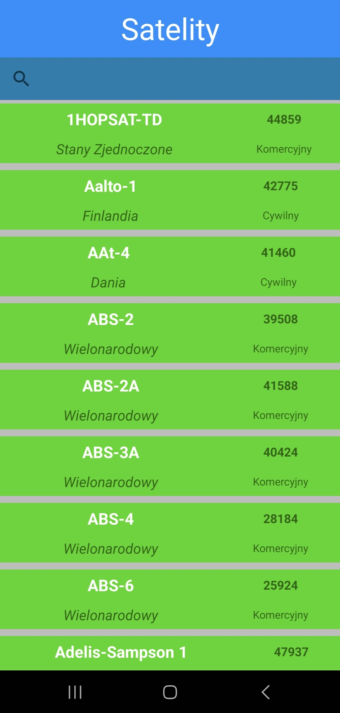
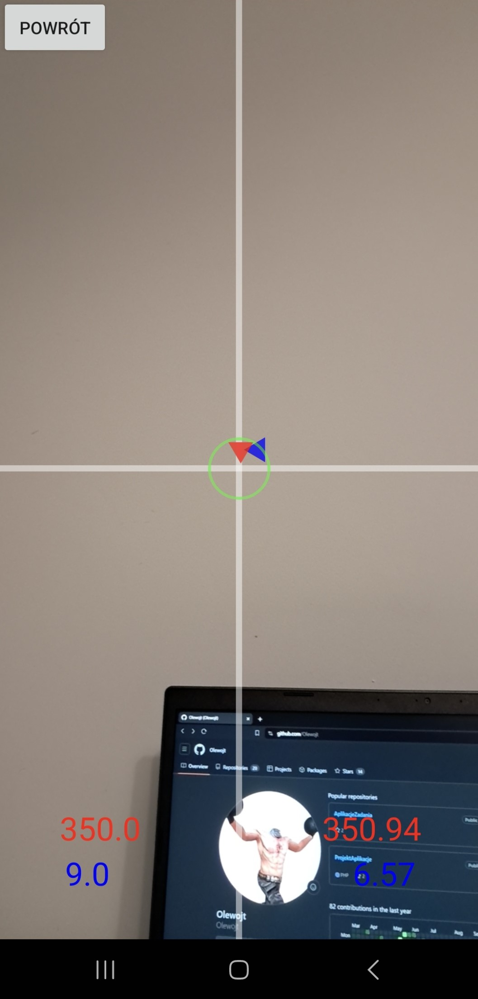

# Satellite tracker
Aplikacja na systemy android służąca do lokalizacji sztucznych satelity (np. satelity pogodowe) na niebie. Aplikacja wykorzystuje aparat telefonu, akcelerometr oraz magnetometr do lokalizowania tychże obiektów. Aktualna pozycja danego obiektu pobierana jest z [API n2yo](https://www.n2yo.com/api/).
# Podgląd
## Lista satelit

## Lokalizowanie satelity

